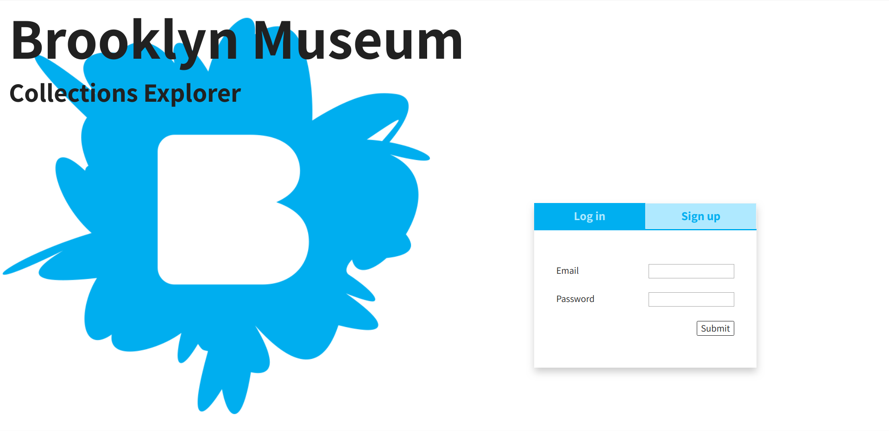
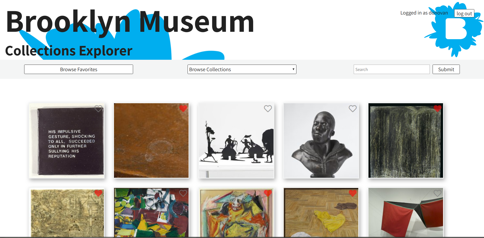
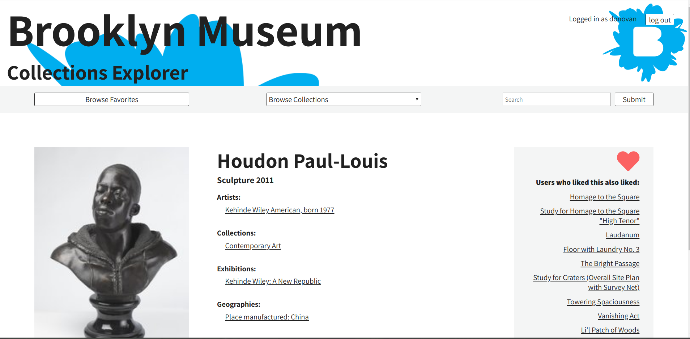

# The Brooklyn Museum Collections Browser

## Description

A user interface to be built around the Brooklyn Museum's database of collections objects. The interface allows users to browse the collection data across broad categories, as well as perform more fine-grained search queries. Users are be able to mark objects as "favorites" for later viewing, and to view object recommendations based on their favorites.

## Tech Stack

* Java Spring Boot, Netflix Eureka, and Netflix Zuul for microservices architecture.
* Java Persistence API, Flyway, and Postgres for data management.
* Firebase for user sign-up and login authorization.
* React.js for front-end UI/UX.

## Install and Testdrive

This project depends upon [docker](https://www.docker.com/) and [docker-compose](https://docs.docker.com/compose/). Make sure you have all of these dependencies installed before you proceed.

1. [Clone this repo](https://help.github.com/articles/cloning-a-repository/) to your machine.
2. In a terminal window, from the top-level project directory run `docker-compose up`.
3. In a separate terminal window, navigate to the `client-ui` directory and run `npm install`.
4. Once npm is finished installing, run `npm start`.
5. Once all of the containers are up and running (wait a minute or two, especially if this is the first time you've docker'd up), navigate to [http://localhost:3000](http://localhost:3000) in your browser and enjoy the app!
6. When you are finished testdriving the app, in the terminal `ctrl + C` to stop the docker images, and then run `docker-compose down` to remove the mounted docker images.

## Features

* Secure sign-up and login with Firebase (although only truly secure if served over HTTPS).
* Options for browsing and searching the collection's objects.
* Options to add and remove objects from a persistent list of "user favorites".
* Detailed views on selected objects, along with high-resolution images.

-------

## Login View

## Home View

## Detail View

